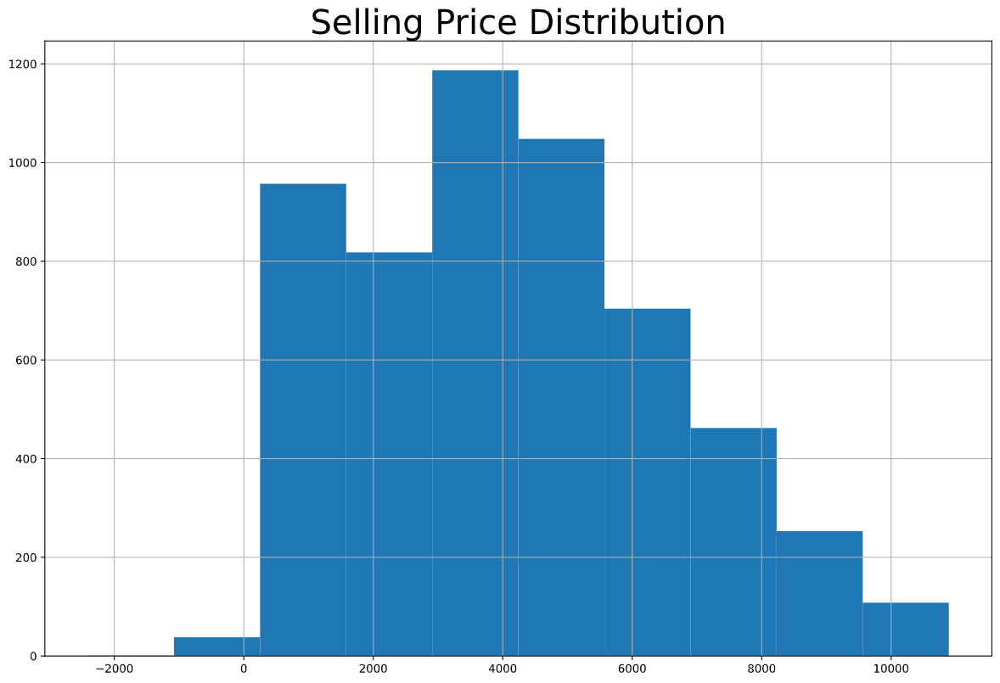
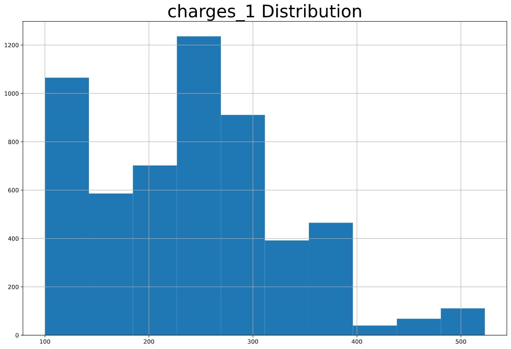
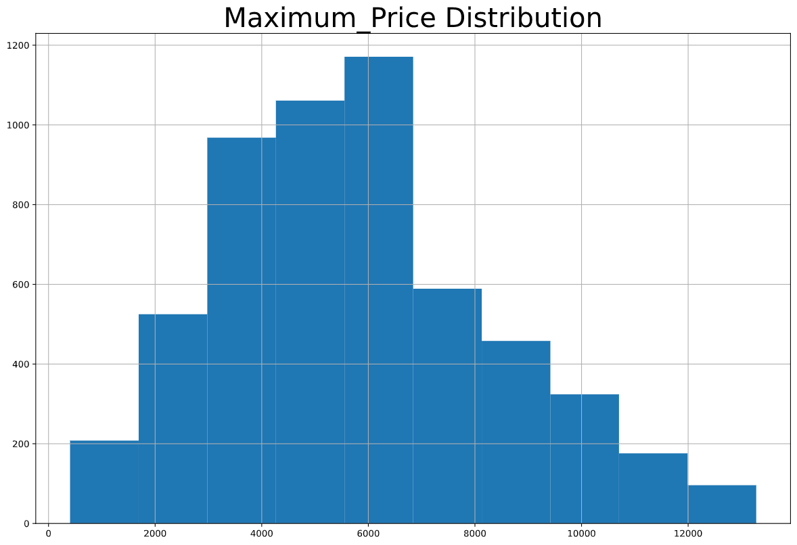
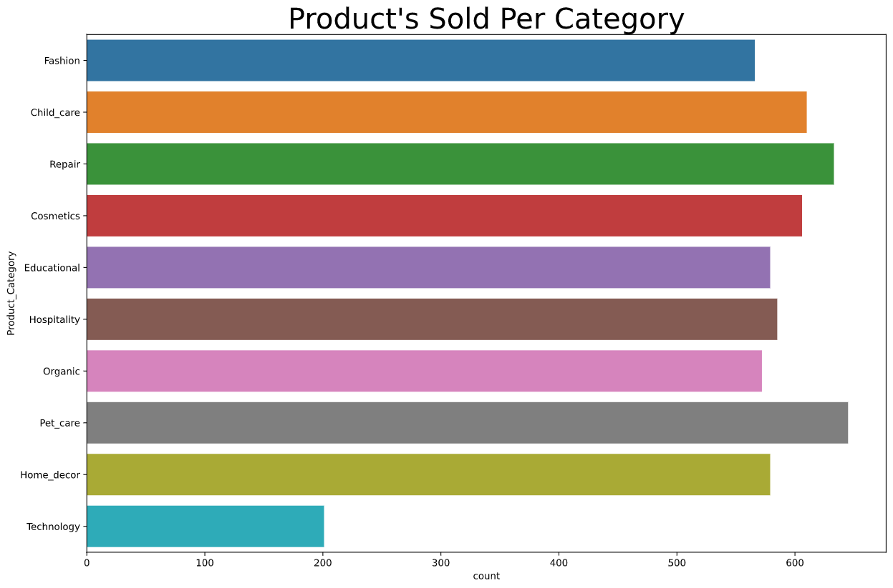
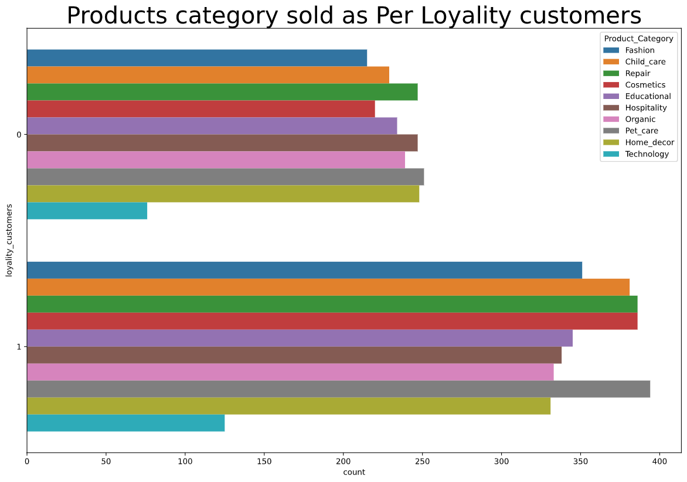
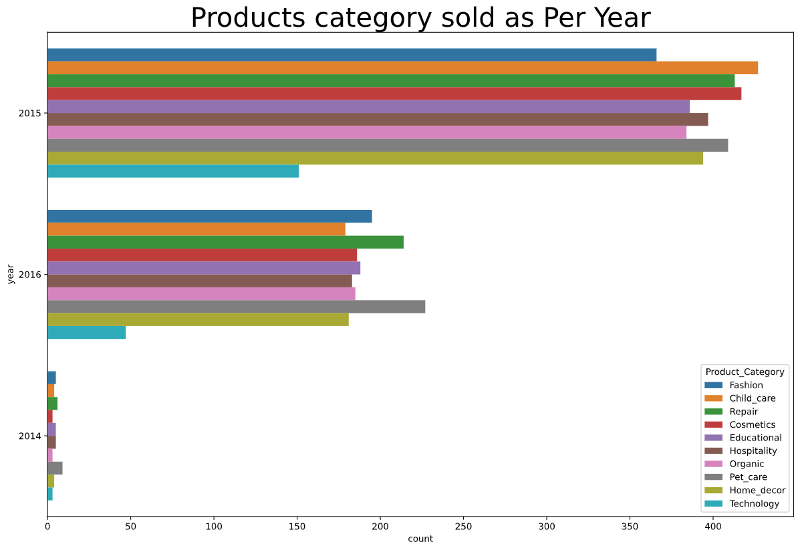

# **My Leaderboard**

**Secured 301 Position out of 2144 participants with `Prediction Score of: 85.17497`**
<br><br>

# **The Process is divided in 4 Steps**
- [x] Cleaning the Data
- [x] Removing Outliers
- [x] EDA on cleaned dataset
- [x] Model Building

# **Cleaning The Data-Set**

**Filling NaN values with Median for Train Dataset**

```python
fill_na_train = train_df['Stall_no'].median()
train_df['Stall_no'].fillna(fill_na_train, inplace=True)

fill_na_train = train_df['Discount_avail'].median()
train_df['Discount_avail'].fillna(fill_na_train, inplace=True)

fill_na_train = train_df['charges_1'].median()
train_df['charges_1'].fillna(fill_na_train, inplace=True)

fill_na_train = train_df['charges_2 (%)'].median()
train_df['charges_2 (%)'].fillna(fill_na_train, inplace=True)

fill_na_train = train_df['Minimum_price'].median()
train_df['Minimum_price'].fillna(fill_na_train, inplace=True)

fill_na_train = train_df['Maximum_price'].median()
train_df['Maximum_price'].fillna(fill_na_train, inplace=True)

fill_na_train = train_df['Selling_Price'].median()
train_df['Selling_Price'].fillna(fill_na_train, inplace=True)
```

**Checking all values were filled**

```python
train_df.isnull().sum()
```
**Output:**
```Product_id            0
Stall_no              0
instock_date          0
Market_Category       0
Customer_name       211
Loyalty_customer      0
Product_Category      0
Grade                 0
Demand                0
Discount_avail        0
charges_1             0
charges_2 (%)         0
Minimum_price         0
Maximum_price         0
Selling_Price         0
dtype: int64
```

**Filling NaN values with Median for Test Dataset**

```python
fill_na_test = test_df['Stall_no'].median()
test_df['Stall_no'].fillna(fill_na_test, inplace=True)

fill_na_test = test_df['charges_1'].median()
test_df['charges_1'].fillna(fill_na_test, inplace=True)

fill_na_test = test_df['charges_2 (%)'].median()
test_df['charges_2 (%)'].fillna(fill_na_test, inplace=True)

fill_na_test = test_df['Minimum_price'].median()
test_df['Minimum_price'].fillna(fill_na_test, inplace=True)
```
**Checking all values were filled**

```python
test_df.isnull().sum()
```

**Output:**
```
Product_id           0
Stall_no             0
instock_date         0
Market_Category      0
Customer_name       53
Loyalty_customer     0
Product_Category     0
Grade                0
Demand               0
Discount_avail       0
charges_1            0
charges_2 (%)        0
Minimum_price        0
Maximum_price        0
dtype: int64
```

<br><br>

# **Removing The Outlier**
 
Removed Outliers by Using IQR method:
```python
def outlier_removal(column):
    sorted(column)
    Q1, Q3 = np.percentile(column, [25, 75])
    
    IQR = Q3 - Q1
    
    lower_value = Q1 - (1.5 * IQR)
    upper_value = Q3 + (1.5 * IQR)
    return lower_value, upper_value
```

<br><br>

# **Doing Some EDA on the cleaned dataset.**

> ***Plotting Distribution for the Data-Set***

### `1. Selling Price Distribution`

<br>

### `2. Charges_1 Distribution`

<br>

### `3. Maximum_Price Distribution`

<br>

### `4. Product Sold Per Category`

<br>

### `5. Products Sold As Per Loyality Customers`

<br>

### `6. Products Sold Per Year(2014, 2015, 2016)`

<br>

### `7. Loyality Customers`

<br>

# **Model Building**

1. Model Preparation
    
    Data for X: 
    > `train[['Stall_no', 'Market_Category', 'Grade', 'Demand', 'Discount_avail',
      'charges_1', 'charges_2 (%)', 'Minimum_price', 'Maximum_price',
      'month', 'year', 'day', 'loyality_customers',
      'Product_Category_Cosmetics', 'Product_Category_Educational',
      'Product_Category_Fashion', 'Product_Category_Home_decor',
      'Product_Category_Hospitality', 'Product_Category_Organic',
      'Product_Category_Pet_care', 'Product_Category_Repair',
      'Product_Category_Technology']]`
    <br>
    
    Data for Y: 
    > `train['Selling_Price']`

<br>

2. Train_Test_Split

    ```python
    from sklearn.model_selection import train_test_split
    X_train, X_test, y_train, y_test = train_test_split(X, y, test_size=0.1, random_state=10)
    ```
<br>

3. Using Random Forest

    ```python
    from sklearn.ensemble import RandomForestRegressor
    reg = RandomForestRegressor(max_depth = 15, random_state=0, n_estimators = 100, verbose = 1)

    reg.fit(X_train,y_train)
    ```
    
    ```python
    reg.score(X_train, y_train)
    ```
    Reg.score: 0.996330144542303
<br><br>
* ## R^2 Value
    Value for rsquare is 0.9722337968809527
    <br>

* ## RMSE Value
    Value for Root Mean Square Error is : 401.4823455561136
    <br>

* ## RMSE Value
    Value for Root Mean Square Error is : 401.4823455561136

<p style="text-align: center;">Hope You Liked My Competition Walkthrough :) </p>
<p style="text-align: center;"> 😀 😄 😃 </p>
